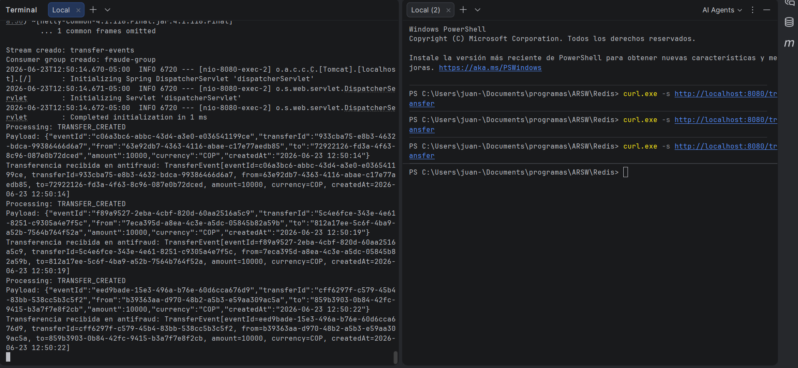

# Redis Stream Workshop

## Funcionamiento
Se creó el servicio de transferencias, con un endpoint /transfer, cuando se hace una peticion a este endpoint,
se crea una transacción y se publica el evento de transaccion creada.

La publicación llega al Brocker de Redis que se crea en un contenedor en Docker con el comando:

```bash
docker run --name redis-arsw -p 6379:6379 -d redis:latest
```

Este tiene el stream: transfer-events

y el grupo: fraude-group

Después que se cree el evento, se retransmite al servicio antifraude que escucha el mensaje con
una clase consumidora al stream y grupo creados anteriormente. 

